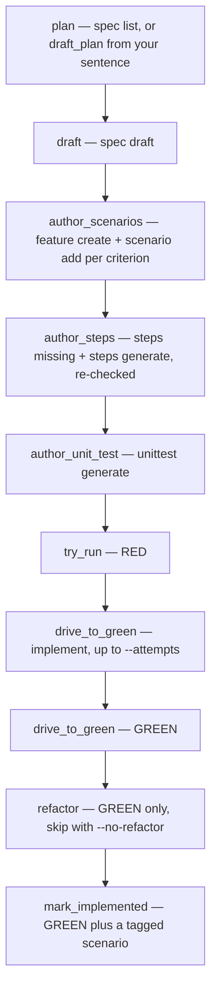

# A Day in the Life of a TDD Agentic Developer — presenter notes

Stage script for the 60-minute talk. The demo builds the harness a new
MCP tool of its own, `criteria_coverage`, starting from **one sentence
typed live** — there is no requirement waiting in the catalog when you
walk on. Everything below is the presenter's copy; the attendee version
is [a-day-in-the-life.md](../student-follow-docs/a-day-in-the-life.md).

The clock times are the story, not the wall clock. The whole demo is
about 28 minutes.

Every command below is run from **inside `harness/`**. There is no
`--root` flag anywhere in this script, and that is deliberate: `spec`
walks up from the working directory to the nearest enclosing project.
`cd harness` once at the start and the tool finds the catalog from
anywhere beneath it, `src/domain` included. If you find yourself typing
`--root`, you are in the wrong directory.

## Before you walk on

```bash
cd <repo>
git switch trunk && git pull
git switch -c talk-$(date +%Y%m%d)         # never demo on trunk
scripts/preflight.sh                       # model, binary, toolchains
cd harness                                 # everything after this runs from here
spec validate                              # must be valid: true
spec list                                  # 16 requirements, 0 pending
spec status                                # nextId: HARNESS-018
cargo test --manifest-path Cargo.toml --test spec_completeness
mvn -f ../smoke-test/pom.xml test -Dspec.binary=$(which spec)
```

**Make the branch before anything else.** Every mutation of the next 28
minutes — the drafted requirement, the new feature file, the generated
test, the implementation, the Java-side bump — lands in the working
tree. On a branch, giving the talk again is one `git branch -D`. On
`trunk` it is an archaeology exercise.

**The starting catalog has nothing pending.** That is the point of the
new opening: the first thing the room sees is an empty backlog and a
human saying a sentence out loud. If `spec list` shows a pending
requirement, a previous talk was not reset — see the reset section.

**`spec status` tells you the id before you draft it.** Read `nextId`
during preflight and use that number in your patter. It is derived from
the catalog, so if the room sees `HARNESS-018` appear, it is because
`HARNESS-017` is the highest id in the file, not because you typed it.
If preflight says something other than `HARNESS-018`, the catalog has
moved on since these notes were written — use what it says, the beat is
identical.

**The `-Dspec.binary` flag is not optional.** `LiveSpecServerTest` is
annotated `@EnabledIfSystemProperty(named = "spec.binary", ...)`. Without
it that test is silently skipped, the Java build stays green when the
server grows a tool the plan does not name, and the best beat in the
talk does not fire. Verified: the planned set green, one tool past it
`BUILD FAILURE`.

The starting state is: 16 implemented requirements, nothing pending,
exactly the planned tools served, every bar green. If `spec_completeness`
is red before you start, the catalog and the feature tags have drifted —
fix that, do not demo around it.

**Optional, and off unless you turn it on: the decision model.** If you
mean to show the 9:10 aside below, do this before you walk on, because
the first call pays a cold-start cost of about a third of a second and
nothing else in the talk does:

```bash
ollama --version                                    # 0.35 or newer, or skip the aside
ollama pull nimble
spec judge models                                   # nimble:latest must be listed
spec config | grep -E "llm.model|decision.model"    # llm.model unchanged, decision.model unset
```

Use the **flag**, not `spec judge use`. The flag configures nothing, so
there is no config edit in your diff and nothing to reset. It also keeps
the "the coding model is untouched" claim trivially true on stage: the
last command above shows `decision.model` with no value at all.

If `ollama --version` is older than 0.35 there is no `/v1/systemone` and
the aside cannot run. Cut it. Nothing later in the talk refers back to
it.

## 9:00 — one sentence

Nothing is waiting. Show the empty backlog first:

```bash
spec status
```

Then say the sentence out loud and type it into the wizard:

```bash
spec draft
```

```
for one requirement, show me which acceptance criteria no test proves
```

Three things happen while it runs, and all three are worth narrating.

**It reads the catalog before it writes.** The model calls
`list_requirements`, then `get_requirement` on a couple of existing
ones, to match the house style before proposing anything. You will see
those calls scroll past. Say what they are: the draft is informed by the
spec that is already there, not by a template.

**The harness rejects its own model, out loud.** Expect at least one:

```text
The model reply was invalid (requirements "..." cover only happy paths -
add at least one edge case to each) - asking again (2 of 3)
```

That is the wording review firing *before anything is written*. Do not
skip past it — it is the single best unplanned moment in the run, and it
sets up 9:10.

**Then it proposes.** The description is broken into atomic
requirements, one capability each.

> **Do not promise a number.** The same sentence gave five proposals on
> one rehearsal and one on the next. Say "it proposes a handful" and
> read whatever is on screen. If you want a predictable slide, the
> count is the one thing here you cannot pin.

### This beat is yours — the first human gate

```text
Accept [Enter for all, or comma-separated numbers]: 1
```

Type `1`. One keystroke, and it is a real decision: the model offered a
backlog and you took one requirement. Everything else it proposed is
discarded, unbuilt, and that is you deciding scope rather than the
machine deciding it for you. Say that out loud — it is the first of the
morning's human moments and the cheapest to miss.

What stages is `HARNESS-018`.

**Stop on the id.** Nobody typed `HARNESS`. The catalog's highest id is
`HARNESS-017`, so the next one is `HARNESS-018` — the prefix is read off
the neighbours, the number is `max + 1` across the merged catalog, and
the padding matches what is already there. Point out that the same
binary drafting into `requirements/` at the repo root would have said
`REQ-007`, because that catalog numbers `REQ`. One tool, no per-project
configuration, and nothing for an agent to guess: `spec status` reports
`nextId` precisely so an agent reads the shape instead of inventing one.

Worth ten seconds: you are standing in `harness/` and never said where
the project is. Run one command from deeper in to make it concrete:

```bash
cd src/domain && spec status && cd ../..
```

Same catalog, found by walking up. This is the first instance of the
argument the whole talk makes — the tool reads its context rather than
being told it.

> **Deliver parity.** `spec deliver "the harness should handle coverage
> properly so gaps are found easily"` runs exactly this as its *draft*
> stage, via `draft_plan`. It drafts, commits, reads back what actually
> reached the catalog, and plans those ids.

## 9:10 — it is clean, and that is the problem

```bash
spec validate            # valid: true
spec refine HARNESS-018  # clean: true
```

**This is not the beat the old version of this talk had, and it is a
better one.** Do not apologise for the green result — walk toward it.

The wording review comes back clean because it *already ran*. You
watched it run at 9:00, inside the draft loop, rejecting the model's
first answer for covering only happy paths. The deterministic gate did
its job thirty seconds ago. Nothing is left for it to find.

So read the criteria the model actually wrote:

```text
Given requirement REQ-001 with 3 acceptance criteria and a feature file holding
1 scenario tagged @REQ-001 proving the first criterion, when the coverage of
REQ-001 is reported, then the report lists criteria 2 and 3 verbatim as uncovered
```

Concrete outcome. Real edge cases. Testable by anyone. **And it is the
wrong requirement.** "When the coverage of REQ-001 is reported" asks for
a *function*. Implement against this and what comes back is
`requirement_coverage()` sitting in a module, which is correct, passes,
and is useless — because the morning is supposed to end with a new tool
answering over MCP, and nothing here asked for a tool.

That is the line to land:

> A rule set can check that an outcome is concrete. It cannot check that
> you asked for the right thing.

The three human moments are unchanged in number and sharper in kind.
This one is not "the machine wrote mush and I tidied it". It is "the
machine wrote something clean, testable, and not what we are building",
and no amount of deterministic review was ever going to catch it.

**If `refine` does return a finding or two**, which happens, read them
and fix them — but do not let that become the beat. The argument above
survives either way, and it is the one worth the room's attention.

### This beat is yours

The human rewrites so that every criterion **names the tool**. Paste
this — it is verified refine-clean, so the pass afterwards comes back
`clean: true` with no findings:

**Title**

```
Uncovered acceptance criteria are reported per requirement
```

**Story**

```
As a developer closing out a requirement, I want each acceptance criterion reported as covered or uncovered by its scenarios and tests so that I can see what is still unproven before I mark the work implemented.
```

**Acceptance criteria**

```
Given a requirement whose every criterion is matched by a tagged scenario and an asserting test, when the criteria_coverage MCP tool is called with its id, then the verdict is "covered"
Given a requirement with 3 criteria of which 1 is matched by no asserting test, when the criteria_coverage MCP tool is called with its id, then 1 criterion is reported uncovered
Given a requirement id that is absent from the spec, when the criteria_coverage MCP tool is called with it, then the reply is an error naming the unknown id
Given a requirement carrying 0 acceptance criteria, when the criteria_coverage MCP tool is called with its id, then the verdict is "uncovered"
```

Four criteria, and every one of them names `criteria_coverage`. That is
the whole edit: the behaviour barely moved, the *contract* did. This is
measured, not asserted — an earlier rehearsal implemented the
model's own wording and got back a plain `requirement_coverage()`
function, green on every criterion and no use at all to the 10:50 beat.

```bash
spec reword HARNESS-018
git diff requirements/  # read the edit out loud
spec refine HARNESS-018 # clean: true, same as before the edit
```

Point at that last line. `refine` said `clean` before the reword and
says `clean` after it. The deterministic review could not tell the
difference between the two requirements, and they build different
software.

> **Deliver parity, and the sharpest one in the talk.** `deliver` has no
> equivalent of this beat: its draft stage runs the same validate/refine
> loop, gets the same `clean`, and proceeds. Run autonomously from this
> sentence, the factory would have built the function — correctly,
> quickly, with a green bar and a tagged scenario, and it would have
> been the wrong thing. Hold that thought until 11:10; it is what the
> autonomous segment is actually about.

### Optional aside, 90 seconds: a model that judges instead of writing

Only if you set it up before walking on. Skip freely — nothing later
refers to it. Worth doing for a room that keeps asking whether a model
could do the reviewing.

Setting it up means a `spec` built from this repository, not the
published release: `spec judge` landed after `v0.7.0` was tagged. Check
with `spec judge models` before the session rather than on stage.

The wording review you just ran is a fixed rule set, and it has a hole.
One rule asks whether the clause after `then` *looks* concrete: a
number, a quoted value, a named error. Any number satisfies it:

```bash
spec --decision-model nimble:latest judge criterion \
  --text "Given the refactored module, when the suite runs, then code quality is improved by at least 20%"
```

`refine` reports **nothing at all** about that criterion. The judgment
reads it at 0.038, `FAILS`. Nobody measured code quality. The rule asks
whether a number is present; it cannot ask whether the number *is* the
assertion.

Then turn it on the wording the room just approved:

```bash
spec --decision-model nimble:latest judge criterion HARNESS-018
```

**Know this result before you show it.** One of the four comes back
`HOLDS` at 0.855. The other three come back `INCONCLUSIVE` at 0.269,
0.745 and 0.298 — and all four are testable. The two in the 0.2s are a
known false alarm: their assertion is a quoted string, but the quoted
word (`"covered"`) reads like a judgement and the model weighs the word
over the quotes. It is in the repository's labeled evaluation with a
note saying so.

Do not apologise for it — it is the strongest version of the point.
Three answers that are wrong or unsure about wording four engineers
agreed on, delivered with exactly the same confident tone as the right
one. Say the line: *this is why it is reported and not obeyed.* Then
read `action`: `CONTINUE`. The deterministic `clean: true` above did not
move, and neither did the three moments that are yours.

If Ollama is not running, the command fails with `cannot reach the
decision model provider` and a nonzero exit. That is also a usable beat
— a question that was never answered is never an answer, and never an
approval — but only if you say it on purpose rather than discovering it.

## 9:30 — the criteria become an executable scenario

```bash
spec feature create --path tests/features/tool_coverage.feature --name "Criteria coverage"
spec scenario generate HARNESS-018 --feature tests/features/tool_coverage.feature
git diff tests/features/
```

`generate`, not `add`. `add` appends one scenario you have already
written out step by step; `generate` is the one that reads the
acceptance criteria and derives the scenarios from them — which is the
whole point of the beat. The feature file has to exist first, and
`feature create` writes it, so the next command reads it straight off
disk.

**This is the slow one.** About five minutes on the big local model, one
model call. Have something to say while it runs: this is the natural
place for the "who wrote the test" argument.

Four scenarios come back, written **from the acceptance criteria** and
tagged `@HARNESS-018` — one per criterion. Nobody re-typed the
requirement into a test.

> **Deliver parity, and a real divergence.** This is `deliver`'s
> `author_scenarios` stage, but the factory does it **deterministically**:
> `create_feature` plus one `add_scenario` per criterion through
> `criterion_to_steps`, with no model call at all. Say this out loud
> rather than papering over it. The model-driven `generate` is the
> better stage moment — it is the one that shows a machine reading
> intent — but the autonomous path trades that for something it can do
> in milliseconds and never get wrong. It also skips the stage entirely
> when a tagged scenario already exists, which is why delivering a
> requirement whose Gherkin you wrote by hand is not an error.

### This beat is yours

Read the diff. `git restore tests/features/` throws it away if the
scenarios are not what you meant.

## 9:50 — the unit test

```bash
spec unittest generate HARNESS-018
git diff
spec steps missing
```

**Check the count, do not assume it.** Whether any steps come back
missing depends on how the model worded the scenarios — it may reuse
definitions the suite already has and report none, or invent new
phrasings and report a dozen. Both happen. If the list is not empty:

```bash
spec steps generate
spec steps missing       # 0
```

One more model call, about a minute. The stubs bind the project's own
`SpecWorld`, read off the glue file rather than assumed — worth saying
out loud if anyone has been bitten by a generator that emitted the
`World` *trait* and would not compile.

> **Deliver parity.** Two stages, in this order: `author_steps` runs
> `steps missing` then `steps generate`, and **re-checks**, looping up to
> `VERIFY_ROUNDS` times while anything is still undefined — the "check
> the count, do not assume it" instruction above, written into the
> machine. If steps are still missing after the last round it stops and
> says how many. Then `author_unit_test` runs `unittest generate`. The
> commits between are automatic.

## 10:00 — RED

```bash
spec test
spec state      # phase: RED
```

A red bar is not a failure, it is proof the test can fail. Say it.

> **Deliver parity.** `try_run`, and it is the one stage with an
> escape hatch: if the language runtime is missing, `deliver` stops with
> "authoring is complete but the tests never ran" rather than pretending.
> The authoring stands on its own either way.

## 10:05 — ask for a cleanup and get told no

```bash
spec refactor --note "tidy the coverage module"
```

Refused: `Never refactor on a red bar`. This is a state machine in
`harness/src/domain/tdd.rs`, not a line in a prompt. An agent cannot
talk its way past it.

> **Deliver parity.** The factory is bound by the identical gate: its
> refactor stage runs only on GREEN. The autonomy is inside the rails,
> not around them — this is the single most important thing to say in
> the whole autonomous segment.

## 10:15 — the developer agent writes the code

```bash
spec implement HARNESS-018
```

What it is allowed to touch: no shell, no free-hand write. It writes
the files the preflight named and nothing else.

The preflight prints where the code will land, and it should say
`src/mcp.rs`. Nothing declares that: the harness matches the
requirement's own When/Then steps to the step definitions that bind
them, follows those one hop into their helpers, and takes the production
file those name through the most distinct symbols. Worth ten seconds on
stage — it is the same "evidence, not configuration" argument the talk
makes about the spec, and the same one the id prefix made at 9:00.

**If it refuses here, that is still the argument.** When every step the
scenarios bind to is a pending `todo!()`, nothing names any production
code and the harness says so instead of picking a file. It needs two
independent names before it will commit, so one accidental word match
cannot decide it. Recover by naming the file yourself and carry on —
the refusal is a better story than a lucky guess:

```bash
spec implement HARNESS-018 --into src/mcp.rs
```

### Do not run this live without a rehearsed result in the cache

Three measured attempts against this crate took **20, 36 and 57
minutes**, and the two that returned code did not compile — a
`Vec<String>` used as a `String`, then a syntax error. Assume this step
cannot be performed in front of the room.

Rehearse the whole morning beforehand and keep the cache. Identical
requests are served from `.spec/cache/` without a model call, and
`cache_ttl_seconds` in `harness/.spec/config.toml` is a day, so a
rehearsal the night before replays in seconds. Rehearse *to the end* —
10:50 and 11:05 call the model too. Two ways it bites: clearing
`harness/.spec/cache` during cleanup throws the rehearsal away, and any
drift from the rehearsed command order changes the prompt and misses.

**Go on stage knowing which version you are giving.** If rehearsal
produced an attempt that compiles and goes green, the cache replays it
and the beat is live. If it did not — which is the likelier outcome on
a local model — implement it yourself beforehand and run this beat as
`git diff` → `spec test` → green. Say that out loud; "the model needed three tries and I wrote it in the end" is a
truer story about agentic TDD than a green bar nobody saw earned, and
the guard rails you have been demonstrating all morning are exactly
what made the failure safe.

What you must not do is start a model call you cannot time-box and
improvise over it.

If it times out rather than answering, the model wanted longer than
`timeout_seconds` under `[llm]` and everything generated so far is lost.
That is 3600 here for this step alone.

Say the scope out loud, because the slide now promises it: what lands is
**one `#[tool]` method** in `harness/src/mcp.rs`. That is a real tool
over the protocol and nothing more — no `spec coverage` subcommand, no
profile offering it to an agent, no prompt naming it. The homework slide
after the close covers all three.

> **Deliver parity.** This is `drive_to_green`, and it is the loop you
> just ran by hand: implement, run the tests, and if the bar is still
> red, implement again — up to `--attempts` times, 3 by default. Your
> manual version is the same loop with you as the exit condition. The
> factory's exit condition is a counter, and when the counter runs out
> it stops and tells you where it got to.

### This beat is yours

```bash
git diff                # review it properly, out loud
```

## 10:40 — GREEN

```bash
spec test
spec state      # phase: GREEN
```

## 10:50 — CI catches what you forgot

This is the moment the room should enjoy. The server now answers with one
more tool than the plan names. Nobody told the Java smoke test.

```bash
mvn -f ../smoke-test/pom.xml test -Dspec.binary=$(which spec)
```

`LiveSpecServerTest` fails: *the live spec binary serves exactly the
planned tools*. The sweep reports `criteria_coverage` as **unexpected** —
a tool the server answers with that no one planned for. `CLI-009` was
written for exactly this: an unplanned MCP tool fails the Java build
until it is planned. One module's spec caught new surface area in another, and
nobody had to remember to look.

Fix it in front of them: add `criteria_coverage` to `ToolPlan`, bump the
count in `ToolPlanTest` and in `CLI-009`'s criteria and its tagged
scenario, rerun, green.

Worth noting as you edit `CLI-009`: you are in the Java module's
catalog now, and its requirements are numbered `CLI`. Same binary, same
commands, a different prefix — read, not configured.

## 11:05 — close it out

```bash
spec mark-implemented HARNESS-018
```

Gated twice: GREEN, plus a scenario carrying the tag. Then:

```bash
cargo test --manifest-path Cargo.toml --test spec_completeness
```

The drift gate now covers 17 requirements, and HARNESS-018's wording is
checked because it is implemented.

> **Deliver parity.** `mark_implemented`, the last stage, behind the
> same two gates. The factory cannot mark work done that has no green
> bar and no tagged scenario any more than you can.

## 11:10 — the same morning, with nobody watching

Everything so far was a human driving one stage at a time. Now run the
whole thing as a factory.

**It asks one question, and this is the beat.** `deliver` writes the
project's real files, so before it starts it offers the run a branch of
its own — the only stop it makes:

```text
This run writes the project's files directly. You are on talk-<date>.
Branch name for this run (Enter for spec/2026-10-05-amber-kite, or n to stay on talk-<date>)
```

Type a name. It answers with the undo, which is the line to read out
loud:

```text
Working on spec/criteria-coverage. Keep it, merge it, or throw the whole
run away with git switch talk-<date> && git branch -D spec/criteria-coverage.
```

That is the whole safety argument for an unattended run in two
sentences: it writes real files, and one `git branch -D` un-writes all
of them. From there, one sentence to an implemented requirement with no
human in the loop:

```bash
spec deliver "every requirement should report which of its criteria no test proves"
```

Narrate the stages as they scroll, because the room has now seen every
one of them by hand:



Three flags are worth naming on the slide:

```bash
spec deliver                      # every pending requirement in the catalog
spec deliver --attempts 5         # how many RED-to-GREEN tries before it gives up
spec deliver --fail-fast          # stop at the first one that falls short
```

`spec deliver` with no target takes **the whole backlog**. That is the
factory: fill the catalog with sentences, walk away, come back to
branches of implemented requirements and a report of the ones that fell
short.

### The honest cost

Say this plainly, and do not soften it. `deliver` answers every prompt
through `AutoPrompter`, which echoes `(spec deliver never stops to ask)`
at each gate. That is the precise inverse of the three moments that were
yours this morning:

| The moment | Manual | `spec deliver` |
| --- | --- | --- |
| The wording the test is generated from | You rewrote it | The model's draft stands |
| The scenarios | You read the diff | Derived, written unread |
| The implementation | You reviewed it | Accepted on a green bar alone |

What it does **not** give up is every gate that is a state machine
rather than a prompt: no refactor on red, no mark-implemented without a
green bar and a tagged scenario. And it does not give up the undo — the
branch it asked for at the top is what makes three unread diffs a
reviewable pull request rather than a mess in your working tree. The
autonomy is bounded by the same rails you spent the morning
demonstrating, and that is the only reason it is safe to leave running.

### Close the loop you opened at 9:10

Now cash in the thought you parked. Had you run `spec deliver` on this
morning's sentence instead of driving it yourself, it would have reached
a green bar, a tagged scenario, and an implemented requirement — and it
would have built `requirement_coverage()`, a function, because nothing
in the model's clean, testable, edge-case-covering criteria ever asked
for a tool. Every gate would have passed. The 10:50 smoke test would
have stayed green, because no new MCP tool existed to be unplanned.

That is the honest shape of the trade, and it is worth saying slowly:

> Autonomy is bounded by the gates, and the gates are all about
> *correctness*. Not one of them asks whether you are building the right
> thing. That question has no state machine, and it is why the wording
> is still yours.

The line that lands: *the gates are not there to slow the human down.
They are what makes it safe to remove the human from everything except
the one decision no machine is checking.*

## 11:15 — the close

Run the tool you just built, on the requirement you just wrote:

```bash
spec mcp call criteria_coverage --arg id=HARNESS-018
```

Every acceptance criterion written at 9:10 has an asserting test. The
morning's work grades itself.

## 11:20 — hand them the rest of it

One slide, and it is a confession: we shipped the tool, not the adoption.
Point at the three gaps and say which one you would do first.

```bash
spec tools enable criteria_coverage --for status
spec tools list --for status
```

That is the cheap one — no recompile, it persists in `.spec/config.toml`,
and it demos in ten seconds if you have time. The other two are a
`Command` arm in `main.rs` and four prompt edits
(`[tool_rules]`, step 8 of `workflow.md`, `[advice]`, `[mcp]`). The
follow-along doc spells out which callers to pick and, more usefully,
which to skip — `implement` itself being the trap: give the implementing
model a coverage oracle and it writes to the report instead of the test.

The line that lands: *a registered tool that no profile offers and no
prompt mentions is a tool nobody calls.*

## If it goes wrong

- **The draft at 9:00 comes back with a different id.** Fine — the
  catalog moved. Use what it says for the rest of the morning; nothing
  depends on the number being 018.
- **The draft proposes a different number of requirements.** Expected.
  Measured at five on one rehearsal and one on the next, from the
  identical sentence. You type `1` either way and the morning is
  unchanged. Never put the count on a slide.
- **The draft takes longer than you remember.** Measured at 3m36s on the
  pinned 125B model, and that is before `scenario generate`. Budget
  nine minutes of model time between the sentence and the first red
  bar, and have the "who wrote the test" argument ready to fill it.
- **`spec draft` cannot reach a model.** The wizard falls back to asking
  you for the title, story and criteria yourself. You have the clean
  wording below at 9:10 — paste it and carry on. Say what happened: the
  tool degraded to asking a human rather than inventing something.
- **`refine` at 9:10 returns findings instead of `clean`.** Also fine.
  Read them, fix them, and then make the argument anyway — the point is
  that a clean review and a correct requirement are different things,
  and that holds whether this particular draft was clean or not.
- **The model stalls on `implement`.** Write the code by hand and keep
  talking. The point of the segment is the gates, not the generation.
- **`refine` comes back clean on the first pass.** The model drafted
  something unusually good from your sentence. Reword it anyway — the
  beat is a human improving a machine's wording, and it survives a
  smaller diff.
- **`spec deliver` stops on the branch question.** That is the script,
  not a fault. Type a name and read the undo line it answers with out
  loud. `spec deliver --no-branch` skips the question entirely, which is
  what to reach for if you are already on a throwaway branch.
- **A command cannot find the project.** You are above `harness/`, so it
  found the repo-root catalog instead — ids will read `REQ-`. `cd
  harness` and run it again.
- **`spec test` is slow.** The scoped filter should keep it to the one
  test binary. If it is running the whole suite, pass the filter
  explicitly rather than waiting.
- **Reset to the stage state:** see below. Throwing the branch away is
  not enough on its own — the TDD phase and the rebuilt binary live
  outside git.

## Reset, to give the talk again

Three kinds of residue, and git only knows about the first.

```bash
# 1. everything the demo wrote, tracked and untracked alike
git switch trunk
git branch -D talk-<date>
git clean -fd harness/ smoke-test/

# 2. the TDD phase - gitignored, so step 1 leaves it
#    behind and the next run starts mid-cycle
rm -rf harness/.spec/state.json

# 2b. the cached model replies - ONLY if you are rehearsing again
#     afterwards. This is what makes the live run take seconds
#     instead of twenty minutes; clearing it the morning of the talk
#     means paying for implement on stage.
rm -rf harness/.spec/cache

# 3. the binary on PATH now serves the tool you added on stage -
#     put a trunk build back
cargo install --path harness --force
```

Because the demo ran on its own branch, step 1 is the whole of the git
side: the drafted requirement, the new feature file, the generated test,
the implementation, and the Java-side plan update all go with the branch.
`git clean` is safe here precisely *because* you are back on `trunk`
with nothing of your own in the working tree — which is the other reason
to make the branch before you walk on. If you are rehearsing from a
working copy that *does* carry unpushed work, `git clean -nd harness/
smoke-test/` lists what would go before anything is removed.

Step 3 is the one that is easy to forget and silently ruins the next
run: `mvn ... -Dspec.binary=$(which spec)` would stay red from the
previous talk, and the 10:50 beat would never fire.

Confirm you are back at the starting state:

```bash
git status --short                   # clean
cd harness
spec mcp tools | wc -l               # the planned count, not one more
spec list                            # 16 requirements, 0 pending
spec status                          # nextId: HARNESS-018
mvn -f ../smoke-test/pom.xml test -Dspec.binary=$(which spec)   # green
```

The check that matters is **`0 pending` and `nextId: HARNESS-018`**. If
anything is pending, the drafted requirement survived the reset and the
9:00 beat is dead — you are still on the talk branch, or you gave the
talk on `trunk`. If `nextId` has moved past 018, a previous run's
requirement was committed; `git checkout trunk -- harness/requirements/`
puts it back.
